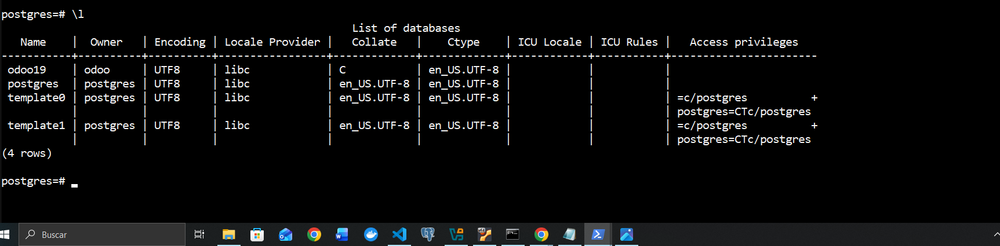
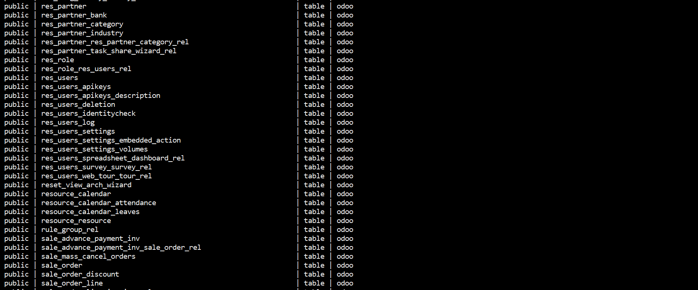
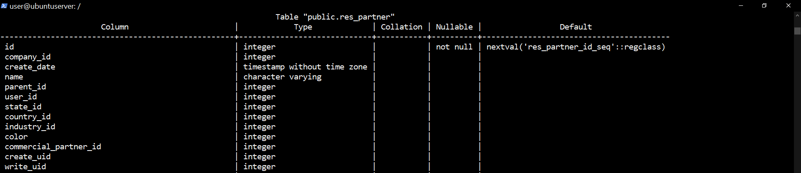
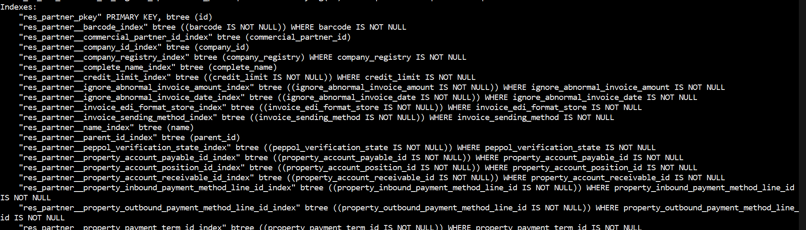
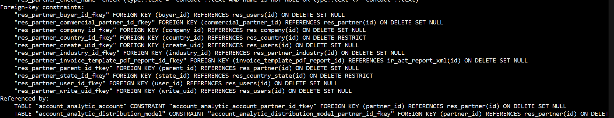

# Analisis de modelos de datos
#### Como funciona Odoo
1. Tablas > donde se guarda la informacion
2. Campos > datos dentro de las tablas
3. Relaciones > como se conectan enre si
Ej. Clientes, Productos, Ventas

#### Entrar en PostgreSQL
```
sudo -u postgres psql
```

ver base de datos 
```
\l
```

```
\c odoo19
```


```
\dt
```




----------
| Tipo de dato | Tabla | Observaciones|
| -----------
| Clientes | res_partner | guarda clientes, contactos y empresas |
| Productos | product_template | guarda informaciones general de los productos y empresas |
| Ventas |sale_ordner | guarda los pedidos |
----------

#### analizar estructura de tablas
- Toca ver que campos tiene cada tabla y localizador las claves.

```
\d res_partner
\d sale_order
\d product_template
```




#### Relaciones entre tablas
1. Cliente y venta
- Tabla principal de clientes: res_partner
- Tabla de ventas: sale_order
- Relacion: sale_order.partner_id -> res_partner.id
```
- Un cliente puede tener varias ventas (pedidos). Una venta puede tener varias lineas. Cada linea de venta apunta a un producto.

